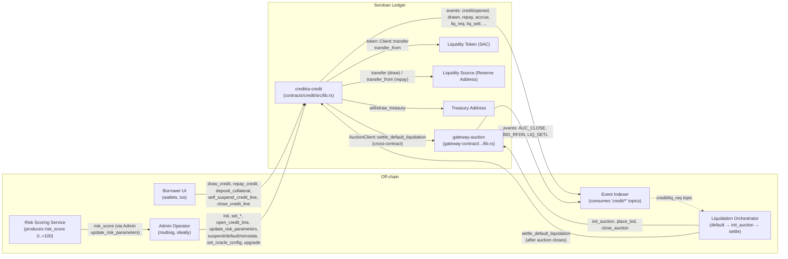
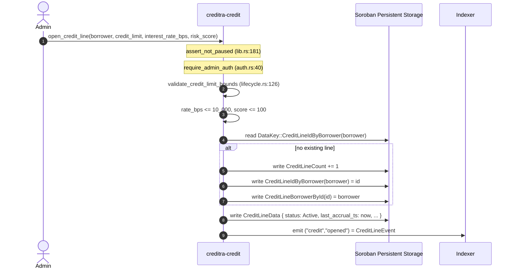
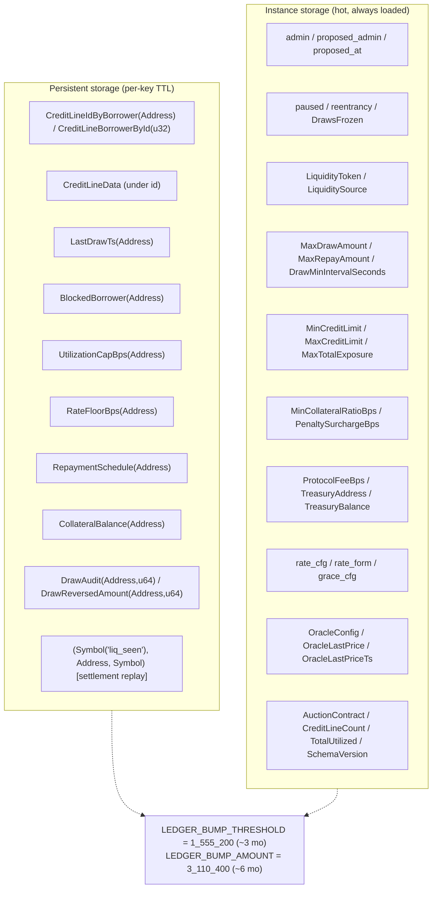
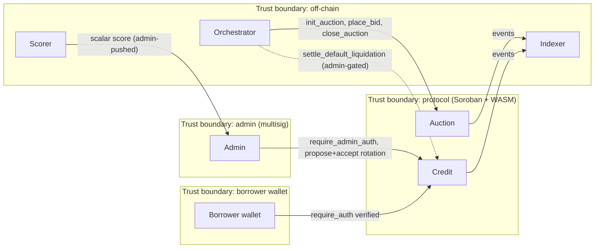

# Creditra System Architecture

This document describes the runtime architecture: how the two contracts and
the off-chain orchestrator are wired together, the call topology, and the
sequence of events for each core protocol flow. All component names and
function signatures are anchored in the source.

For the per-module contract surface, see `docs/PROTOCOL_SPEC.md`.
For the protocol-level model, see `WHITEPAPER.md`.

---

## 1. Component Diagram



**Notes on the topology:**

- The credit contract is the **only** contract that mutates borrower state.
- The auction contract has no read or write access to the credit contract's
  state; the handoff is a single asserted cross-contract call.
- The off-chain orchestrator is *not* a trusted party — it is incentivized by
  protocol design to call settlement on a closed auction; if it doesn't, the
  admin can call it directly.
- The risk-scoring service is, in v1, an off-chain process whose output is
  pushed on-chain by the admin via `update_risk_parameters`. The path to
  decentralization is via `docs/default-oracle.md`.

---

## 2. Sequence: Credit-line Origination



---

## 3. Sequence: Draw

```mermaid
sequenceDiagram
    autonumber
    actor Borrower
    participant Credit as creditra-credit
    participant Storage as Persistent Storage
    participant Token as Liquidity Token (SAC)
    participant Reserve as Liquidity Source

    Borrower->>Credit: draw_credit(borrower, amount)
    Note over Credit: assert_not_paused
    Note over Credit: set_reentrancy_guard (storage.rs:316)
    Credit->>Borrower: require_auth() [host fn]
    Credit->>Credit: amount > 0 / not frozen / amount <= MaxDrawAmount
    Credit->>Credit: !is_borrower_blocked
    Credit->>Storage: get_credit_line(borrower)
    Credit->>Credit: apply_accrual (accrual.rs:87)
    Credit->>Credit: draw_status_error: Active|Restricted pass; else revert
    Credit->>Credit: cooldown: now - LastDrawTs > DrawMinIntervalSeconds
    Credit->>Credit: utilized + amount via checked_add, then <= credit_limit
    Credit->>Credit: collateral ratio check (collateral.rs)
    Credit->>Credit: per-borrower utilization cap
    Credit->>Credit: global MaxTotalExposure check
    Credit->>Reserve: token::Client::balance(reserve) >= amount
    Credit->>Token: transfer(reserve, borrower, amount)   %% external call
    Note over Credit: reentrancy guard prevents re-entry here
    Credit->>Storage: persist_credit_line(prev_utilized, line) [adjusts TotalUtilized]
    Credit->>Storage: set_last_draw_ts(borrower, now)
    Credit->>Storage: write DrawAudit(borrower, now) = amount
    Note over Credit: clear_reentrancy_guard
    Credit-->>Borrower: emit ("credit","drawn") = DrawnEvent
```

---

## 4. Sequence: Repayment

```mermaid
sequenceDiagram
    autonumber
    actor Borrower
    participant Credit as creditra-credit
    participant Token as Liquidity Token
    participant Reserve as Liquidity Source
    participant Storage

    Borrower->>Credit: repay_credit(borrower, amount)
    Note over Credit: NO pause check (repay always allowed)
    Note over Credit: set_reentrancy_guard
    Credit->>Borrower: require_auth()
    Credit->>Credit: amount > 0; amount <= MaxRepayAmount
    Credit->>Storage: get_credit_line(borrower)
    Credit->>Credit: apply_accrual
    Credit->>Credit: status != Closed
    Credit->>Credit: effective_repay = min(amount, utilized_amount)
    Credit->>Credit: interest_repaid = min(effective_repay, accrued_interest)
    Credit->>Credit: principal_repaid = effective_repay - interest_repaid
    Credit->>Credit: fee = interest_repaid * protocol_fee_bps / 10000
    Credit->>Token: transfer_from(borrower, contract, fee)
    Credit->>Token: transfer_from(borrower, reserve, effective_repay - fee)
    Credit->>Storage: persist_credit_line (decrements utilized + accrued_interest)
    Credit->>Storage: advance_repayment_schedule_after_repay (next_due_ts forward)
    Credit-->>Borrower: emit ("credit","repay") = RepaymentEvent
    Credit-->>Borrower: emit ("credit","accrue") + ("credit","fee_accrd")
    Note over Credit: clear_reentrancy_guard
```

**Why interest-first?** A repayment must reduce the *cost-bearing* component
of the debt before the principal. Otherwise a borrower making the
minimum-payment-to-cover-interest would not reduce the principal, and
amortization would be unpredictable. The split is enforced by
`contracts/credit/src/lib.rs:437-556` and tested in `tests/protocol_fee.rs`.

---

## 5. Sequence: Default → Auction → Settlement

This is the full cross-contract flow. Each step has a corresponding test in
`contracts/credit/tests/credit_auction_e2e.rs`.

```mermaid
sequenceDiagram
    autonumber
    actor Admin
    actor Bidder
    participant Credit as creditra-credit
    participant Auction as gateway-auction
    participant Indexer
    participant Orchestrator

    Admin->>Credit: default_credit_line(borrower)
    Note over Credit: require_admin_auth, assert_not_paused
    Credit->>Credit: apply_accrual (capitalize before default)
    Credit->>Credit: status: {Active|Restricted|Suspended} → Defaulted
    Credit-->>Indexer: emit ("credit","defaulted")
    Credit-->>Indexer: emit ("credit","liq_req") = (borrower, utilized_amount)
    Indexer-->>Orchestrator: notify of liq_req

    Orchestrator->>Auction: init_auction(auction_id, mode, start, end, min_bid, min_inc_bps, dutch_start?, dutch_floor?)
    Auction->>Auction: validate start<end, min_inc<=10000, Dutch invariants
    Auction-->>Indexer: (init events)

    loop English mode: ascending bids until close
        Bidder->>Auction: place_bid(auction_id, bidder, amount)
        Auction->>Auction: amount > max(highest_bid, min_bid-1) + ceil(highest*inc/10000)
        Auction->>Auction: set_reentrancy_guard
        opt previous bidder exists
            Auction-->>Indexer: emit BID_RFDN
            Auction->>Auction: refund prev bidder (token CPI)
        end
        Auction->>Auction: highest_bidder/highest_bid := new
        Auction->>Auction: clear_reentrancy_guard
    end

    alt End time reached (English)
        Orchestrator->>Auction: close_auction(auction_id)
        Auction->>Auction: status := Closed
        Auction-->>Indexer: emit AUC_CLOSE
    else Dutch mode: first qualifying bid auto-closes
        Bidder->>Auction: place_bid (qualifies vs compute_dutch_price)
        Auction->>Auction: status := Closed (atomic with bid record)
        Auction-->>Indexer: emit AUC_CLOSE
    end

    Admin->>Credit: settle_default_liquidation(borrower, recovered_amount, settlement_id, oracle_price)
    Note over Credit: set_reentrancy_guard, assert_not_paused
    opt OracleConfig present
        Credit->>Credit: oracle_price valid, fresh, within deviation
        Credit->>Credit: persist OracleLastPrice/Ts atomically
        Credit-->>Indexer: emit ("credit","orc_price")
    end
    opt AuctionContract set
        Credit->>Auction: settle_default_liquidation(settlement_id, credit_addr, borrower)
        Auction->>Auction: status == Closed, factory-only, replay-protected
        Auction-->>Indexer: emit LIQ_SETL
        Auction-->>Credit: return highest_bid (i128)
        Credit->>Credit: assert return == recovered_amount else InvalidAmount
    end
    Credit->>Credit: replay-check (Symbol("liq_seen"), borrower, settlement_id)
    Credit->>Credit: decrement utilized + accrued_interest pro-rata
    alt utilized_amount == 0
        Credit->>Credit: status := Closed; clear RepaymentSchedule
    end
    Credit-->>Indexer: emit ("credit","liq_setl") = DefaultLiquidationSettledEvent
    Note over Credit: clear_reentrancy_guard
```

**Why two contracts?** The auction is replaceable. The credit contract talks
to whichever `AuctionContract` address the admin sets, and the settlement
handshake (`settle_default_liquidation` on both sides, with mutually replay-
protected markers and a return-value assertion) is the only point of
coupling. This isolates the credit invariants from changes to auction
mechanics (e.g. a future sealed-bid or batch-auction implementation).

---

## 6. State Diagram: Credit Line Lifecycle

```mermaid
stateDiagram-v2
    [*] --> Draft : pre-init
    Draft --> Active : open_credit_line (admin)

    Active --> Restricted : update_risk_parameters lowers limit below utilized
    Restricted --> Active : repay_credit until utilized <= new limit

    Active --> Suspended : suspend_credit_line (admin)
    Active --> Suspended : self_suspend_credit_line (borrower)
    Suspended --> Active : reinstate_credit_line (admin, target=Active)
    Suspended --> Restricted : reinstate_credit_line (admin, target=Restricted)

    Active --> Defaulted : default_credit_line (admin)
    Restricted --> Defaulted : default_credit_line (admin)
    Suspended --> Defaulted : default_credit_line (admin)
    Defaulted --> Active : reinstate_credit_line (admin)
    Defaulted --> Restricted : reinstate_credit_line (admin)
    Defaulted --> Closed : settle_default_liquidation (utilized → 0)

    Active --> Closed : close_credit_line (borrower if utilized=0; admin always)
    Restricted --> Closed : close_credit_line (admin)
    Suspended --> Closed : close_credit_line (admin)

    Closed --> [*]

    note right of Active
      draw: yes
      repay: yes
      update_risk_parameters: yes
    end note

    note right of Restricted
      draw: rejected by OverLimit
      repay: yes (cures back to Active)
      update_risk_parameters: yes
    end note

    note right of Suspended
      draw: rejected by CreditLineSuspended
      repay: yes
      grace policy applied during accrual
    end note

    note right of Defaulted
      draw: rejected by CreditLineDefaulted
      repay: yes
      settlement is the cure path
    end note

    note right of Closed
      terminal; idempotent close
    end note
```



Detailed transition rules are in `docs/state-machine.md` and the source at
`contracts/credit/src/lifecycle.rs`. Implementation invariants:

- `apply_accrual` is called **before** every state transition.
- `persist_credit_line(prev_utilized, line)` updates the global
  `TotalUtilized` accumulator atomically with the line write.
- `suspension_ts` is monotone non-decreasing; `assert_ts_monotonic` enforces.
- Settlement uses the `(borrower, settlement_id)` persistent dedup marker.

---

## 7. Storage & TTL Architecture



Every persistent read/write goes through the helpers in
`contracts/credit/src/storage.rs` which call `bump_credit_line_ttl` /
`bump_instance_ttl` on access. The cadence:

- If remaining TTL drops below `LEDGER_BUMP_THRESHOLD` (~3 months),
- extend by `LEDGER_BUMP_AMOUNT` (~6 months).

This means active borrowers' data is automatically refreshed; dormant data
(no activity in ~6 months) expires. The `accrue_batch` keeper hook
(`lib.rs:1133`, capped at `ACCRUE_BATCH_MAX = 50`) lets an indexer-driven
worker re-bump dormant lines cheaply.

The auction contract uses shorter TTLs
(`PERSISTENT_BUMP_AMOUNT = 518_400` ≈ 30 d,
`PERSISTENT_LIFETIME_THRESHOLD = 120_960` ≈ 7 d) since auctions are
short-lived by nature.

---

## 8. Cross-contract Call Topology

The credit contract's outward edges:

| Direction | Target | Method | Purpose | Where |
|---|---|---|---|---|
| Out | `LiquidityToken` (SAC) | `transfer(from, to, amount)` | Move funds reserve → borrower on draw | `lib.rs:261-424` |
| Out | `LiquidityToken` (SAC) | `transfer_from(from, to, amount)` | Move funds borrower → contract (fee) and borrower → reserve (principal+interest-fee) on repay | `lib.rs:437-556` |
| Out | `LiquidityToken` (SAC) | `balance(addr)` | Read reserve balance for the pre-transfer check | `lib.rs:261-424` step 19 |
| Out | `LiquidityToken` (SAC) | `transfer(contract, treasury, amount)` | Drain fee accumulator | `lib.rs:770` |
| Out | `LiquidityToken` (SAC) | `transfer(borrower, contract, amount)` | Collateral deposit | `collateral.rs:34` |
| Out | `LiquidityToken` (SAC) | `transfer(contract, borrower, amount)` | Collateral withdraw | `collateral.rs:69` |
| Out | `AuctionContract` | `settle_default_liquidation(auction_id, credit, borrower) -> i128` | Cross-contract settlement | `lib.rs:953` |
| In  | Admin | All `set_*`, `open_credit_line`, `update_risk_parameters`, etc. | Admin operations | `auth.rs`, all `lib.rs` admin entrypoints |
| In  | Borrower | `draw_credit`, `repay_credit`, `deposit_collateral`, `withdraw_collateral`, `self_suspend_credit_line`, `close_credit_line` (if utilized=0) | Borrower flows | per file |
| In  | Keeper / indexer | `accrue_batch` (no auth), all read-only queries | Maintenance | `lib.rs:1133` |

Auction contract's outward edges:

| Direction | Target | Method | Purpose |
|---|---|---|---|
| Out | Bid token (SAC) | `transfer(contract, prev_bidder, amount)` | Refund prior English bidder under reentrancy guard |
| Out | Bid token (SAC) | `transfer(contract, winner, amount)` | (claim_auction placeholder; transfer is currently commented in source) |
| In  | Factory (credit contract) | `settle_default_liquidation(auction_id, credit, borrower)` | One-shot settlement |
| In  | Bidder | `place_bid(auction_id, bidder, amount)` | Public bid path |
| In  | Admin | `init_auction`, `close_auction`, `set_factory_contract` | Operator flow |
| In  | Winner | `claim_auction(auction_id)` | Post-settlement payout |

---

## 9. Trust Boundaries



The protocol code trusts:
1. Soroban host functions (`require_auth`, `env.ledger().timestamp()`,
   storage ops, deployer).
2. The `LiquidityToken` honoring the standard token interface.
3. The admin's good faith **bounded by** the rate cap, exposure cap,
   rate-change cap, and proposal delay.

The protocol code does **not** trust:
- The off-chain scorer (the score is treated as a bounded input).
- The off-chain orchestrator (settlement is replay-protected and the
  cross-contract return is asserted).
- Hostile token contracts (reentrancy guard).
- Untrusted oracle reports (deviation + staleness breaker).

---

## 10. Event Topology (Indexing Surface)

All event topics emitted by both contracts. The off-chain indexer subscribes
to these topics and reconstructs the protocol's state machine.

| Topic (credit contract) | Payload | When |
|---|---|---|
| `("credit","opened")` | `CreditLineEvent` | New line or admin re-open |
| `("credit","drawn")` | `DrawnEvent` | Successful draw |
| `("credit","draw_rev")` | `DrawReversedEvent` | Admin reversal |
| `("credit","repay")` | `RepaymentEvent` | Successful repay |
| `("credit","accrue")` | `InterestAccruedEvent` | Whenever ΔI > 0 |
| `("credit","fee_accrd")` | `FeeAccruedEvent` | When protocol fee deducted |
| `("credit","suspend")` | `CreditLineEvent` | Admin suspend |
| `("credit","closed")` | `CreditLineEvent` | Borrower or admin close |
| `("credit","defaulted")` | `CreditLineEvent` | Admin default |
| `("credit","reinstate")` | `CreditLineEvent` | Admin reinstate |
| `("credit","liq_req")` | `(Address, i128)` | Default triggers liquidation request |
| `("credit","liq_setl")` | `DefaultLiquidationSettledEvent` | Settlement applied |
| `("credit","risk_upd")` | `RiskParametersUpdatedEvent` | `update_risk_parameters` |
| `("credit","drw_freeze")` | `DrawsFrozenEvent` | Global freeze toggle |
| `("credit","rate_form")` | `bool` | Rate formula enable/disable |
| `("credit","paused")` / `("unpaused")` | `bool` | Pause toggle |
| `("blk_chg",)` | `BorrowerBlockedEvent` | Blocklist change |
| `("credit","pen_enter")` / `("pen_exit")` | `PenaltyRate*Event` | Delinquency enter/exit |
| `("credit","col_dep")` / `("col_wit")` | `Collateral*Event` | Collateral movement |
| `("credit","admin_prop")` / `("admin_acc")` | `AdminRotation*Event` | Admin rotation |
| `("credit","orc_cfg")` | `(u32, u64)` | Oracle config set |
| `("credit","orc_price")` | `(i128, u64)` | Oracle price accepted |
| `("credit","upgraded")` | `ContractUpgradedEvent` | WASM upgrade |

| Topic (auction) | Payload | When |
|---|---|---|
| `("AUC_CLOSE", auction_id)` | `AuctionClosedEvent` | Close (manual or Dutch auto) |
| `("BID_RFDN", auction_id)` | `BidRefundedEvent` | Prior bidder refund (English) |
| `("LIQ_SETL", auction_id)` | `DefaultLiquidationSettlementEvent` | Settlement from credit factory |

See `docs/indexer-integration.md` for JSON decoding examples.

---

## 11. References

- `contracts/credit/src/lib.rs` — all entrypoints
- `contracts/credit/src/lifecycle.rs` — state machine implementation
- `contracts/credit/src/accrual.rs` — accrual fold
- `contracts/credit/src/storage.rs` — storage abstraction & TTL
- `gateway-contract/contracts/auction_contract/src/lib.rs` — auction
- `docs/PROTOCOL_SPEC.md` — per-entrypoint contract surface
- `docs/state-machine.md` — exhaustive state transitions
- `docs/storage-layout.md` — storage tier reference
- `docs/threat-model.md` — authorization matrix
- `docs/indexer-integration.md` — event decoding
- `docs/default-liquidation-auction-hook.md` — handoff details
