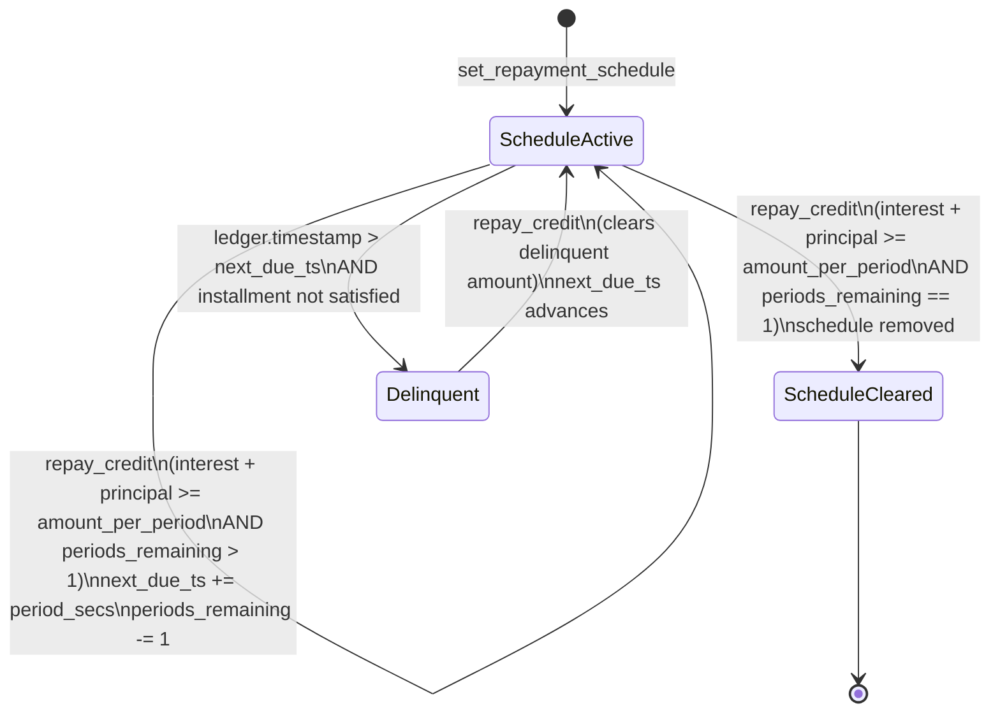

# Repayment Schedule State Machine

This document describes how the installment repayment schedule advances (or
does not advance) in response to `repay_credit` calls.  It is the authoritative
prose complement to the Mermaid diagrams in `docs/ARCHITECTURE.md`.

---

## Overview

A credit line may carry a **repayment schedule** configured via
`set_repayment_schedule`.  The schedule tracks:

| Field | Type | Meaning |
|---|---|---|
| `amount_per_period` | `i128` | Principal that must be retired each period |
| `next_due_ts` | `u64` | Unix timestamp of the next instalment due date |
| `period_secs` | `u64` | Duration of each period in seconds |
| `periods_remaining` | `u32` | How many instalments are still outstanding |

---

## When `next_due_ts` Advances

`next_due_ts` advances by exactly **one** `period_secs` when a `repay_credit`
call satisfies **both** of the following conditions simultaneously:

1. **All accrued interest is cleared** — the payment covers any outstanding
   interest before principal is counted.
2. **At least `amount_per_period` of principal is retired** in the same call.

If either condition is not met, `next_due_ts` remains unchanged regardless of
the repayment amount.

### Formal rule

```
let interest_cleared = repay_amount >= accrued_interest
let principal_paid   = repay_amount - min(repay_amount, accrued_interest)

if interest_cleared && principal_paid >= amount_per_period {
    next_due_ts     += period_secs
    periods_remaining -= 1
}
```

---

## Interest-Only Repayment (Zero Principal) — Issue #503

**Edge case:** when `repay_amount == accrued_interest` (interest-only), the
principal component is zero, which is strictly less than `amount_per_period`.
Therefore `next_due_ts` does **not** advance.

This is the correct and intentional behaviour:

- An interest payment reduces the outstanding balance but does not satisfy the
  instalment obligation.
- Advancing the due date on an interest-only payment would allow a borrower to
  defer principal indefinitely by making small interest payments.

### Example

```
credit_limit       = 1_000_000
draw_amount        = 600_000
rate_bps           = 1_000  (10 % p.a.)
amount_per_period  = 100_000
period_secs        = 2_592_000  (30 days)
first_due_ts       = T0 + period_secs
```

| Time | Action | Repay amount | `next_due_ts` | Advances? |
|---|---|---|---|---|
| T0 + 15 days | Interest-only | ~8 219 | T0 + 30 days | **No** |
| T0 + 30 days | Interest + principal | ~16 438 + 100 000 | T0 + 60 days | **Yes** |

---

## Partial Principal Repayment

Repaying interest plus **less than** `amount_per_period` in principal also does
not advance the schedule.  Even one stroop below the threshold is insufficient.

---

## Over-Payment in a Single Call

If a single `repay_credit` call retires enough principal to cover two or more
periods, the schedule still advances by **exactly one period**.  The contract
processes instalments one at a time; the surplus principal reduces the
outstanding balance but does not pre-pay future instalments.

---

## Schedule Exhaustion

When `periods_remaining` reaches zero after an advance:

- The schedule is considered **fully satisfied**.
- Subsequent calls to `get_repayment_schedule` return `None`.
- `is_delinquent` returns `false` (no outstanding schedule → no delinquency).

---

## State Diagram



---

## Test Coverage (issue #503)

The following tests in `contracts/credit/tests/installment_interest_only_repay.rs`
cover this state machine:

| Test | Scenario | Expected outcome |
|---|---|---|
| `interest_only_does_not_advance` | Repay = accrued interest only | `next_due_ts` unchanged |
| `interest_plus_installment_advances_one_period` | Repay = interest + `amount_per_period` | `next_due_ts` += `period_secs` |
| `partial_principal_does_not_advance` | Repay = interest + (`amount_per_period` − 1) | `next_due_ts` unchanged |
| `double_principal_advances_only_one_period` | Repay = interest + 2 × `amount_per_period` | `next_due_ts` += `period_secs` (not ×2) |
| `zero_repay_does_not_advance` | Repay = 0 | `next_due_ts` unchanged |
| `sequential_interest_only_then_full_repay` | Two-step: interest-only → full repay | Step 1 unchanged; Step 2 advances |

---

## Related

- `contracts/credit/src/lifecycle.rs` — `advance_repayment_schedule_after_repay`
- `contracts/credit/src/accrual.rs` — `apply_accrual`, interest computation
- `contracts/credit/src/math_utils.rs` — `prorate_interest`, `Rounding`
- `docs/PROTOCOL_SPEC.md` — `set_repayment_schedule`, `is_delinquent` entrypoint specs